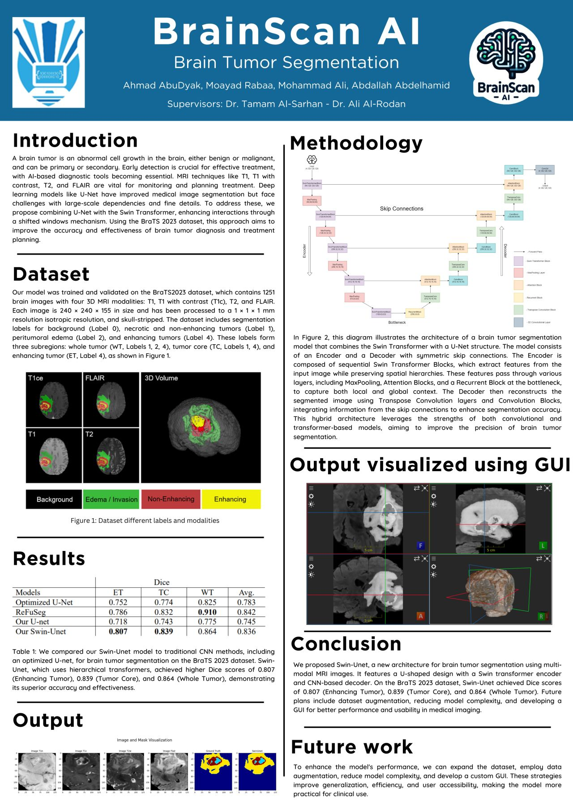

# BrainScanAI
BrainScan AI is a research project focused on brain tumor segmentation using a U-Net with Swin Transformers. Trained on the BraTS2023 dataset, it accurately identifies tumor regions from MRI scans, supporting diagnosis and treatment planning. The study demonstrates high Dice scores and visualizes results through an intuitive GUI.

